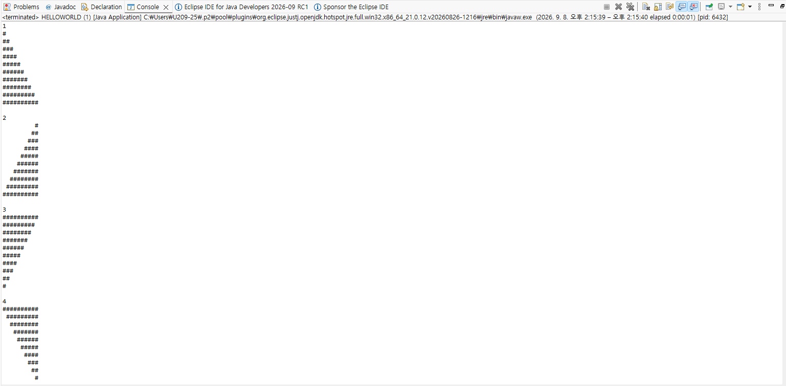
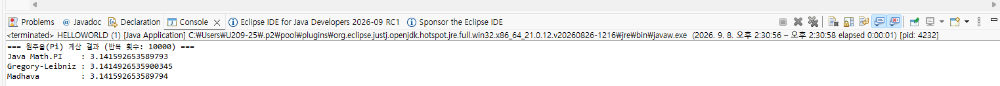

# OOP2026

Homework1

```java
public class HELLOWORLD {
    public static void main(String[] args) {
        
        System.out.println("1");
        for (int i = 0; i < 10; i++) {
            for (int j = 0; j <= i; j++) {
                System.out.print("#");
            }
            System.out.println();
        }
        
        System.out.println();
        
        System.out.println("2");
        for (int i = 0; i < 10; i++) {
            for (int j = 0; j < 9 - i; j++) {
                System.out.print(" ");
            }
            for (int j = 0; j <= i; j++) {
                System.out.print("#");
            }
            System.out.println();
        }
        
        System.out.println();
        
        System.out.println("3");
        for (int i = 0; i < 10; i++) {
            for (int j = 0; j < 10 - i; j++) {
                System.out.print("#");
            }
            System.out.println();
        }
        
        System.out.println();
        
        System.out.println("4");
        for (int i = 0; i < 10; i++) {
            for (int j = 0; j < i; j++) {
                System.out.print(" ");
            }
            for (int j = 0; j < 10 - i; j++) {
                System.out.print("#");
            }
            System.out.println();
        }
    }
}

```



```java
public class HELLOWORLD {
    public static void main(String[] args) {
        int iterations = 10000;

        // 1. Gregory-Leibniz 급수 계산
        double piLeibniz = 0.0;
        for (int k = 0; k < iterations; k++) {
            double term = 4.0 / (2 * k + 1);
            if (k % 2 == 0) {
                piLeibniz += term;
            } else {
                piLeibniz -= term;
            }
        }

        // 2. Madhava 급수 계산
        double sumMadhava = 0.0;
        for (int k = 0; k < iterations; k++) {
            double term = Math.pow(-3, -k) / (2 * k + 1);
            sumMadhava += term;
        }
        double piMadhava = Math.sqrt(12) * sumMadhava;

        System.out.println("=== 원주율(Pi) 계산 결과 (반복 횟수: " + iterations + ") ===");
        System.out.println("Java Math.PI    : " + Math.PI);
        System.out.println("Gregory-Leibniz : " + piLeibniz);
        System.out.println("Madhava         : " + piMadhava);
    }
}

```

