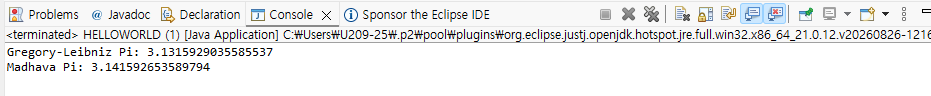
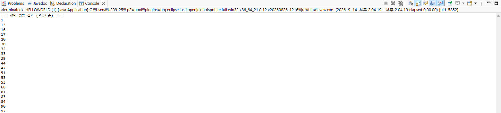
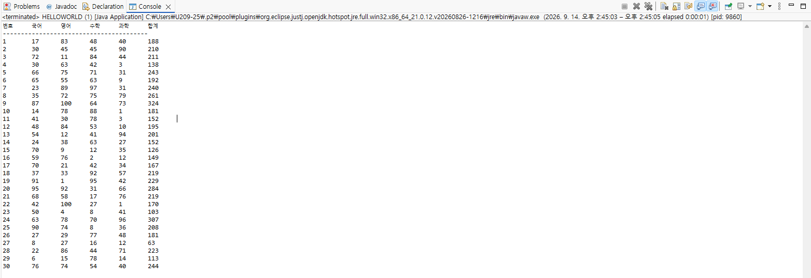
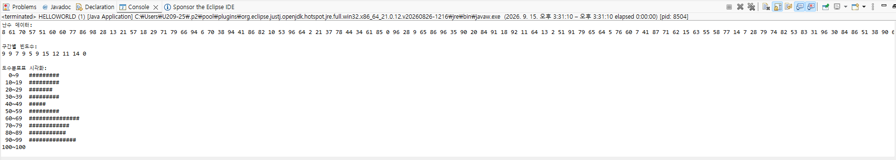
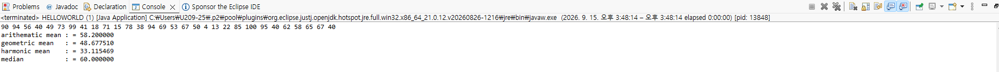

# OOP2026

# Homework1

```java
public class HELLOWORLD {
    public static void main(String[] args) {
        
        System.out.println("1");
        for (int i = 0; i < 10; i++) {
            for (int j = 0; j <= i; j++) {
                System.out.print("#");
            }
            System.out.println();
        }
        
        System.out.println();
        
        System.out.println("2");
        for (int i = 0; i < 10; i++) {
            for (int j = 0; j < 9 - i; j++) {
                System.out.print(" ");
            }
            for (int j = 0; j <= i; j++) {
                System.out.print("#");
            }
            System.out.println();
        }
        
        System.out.println();
        
        System.out.println("3");
        for (int i = 0; i < 10; i++) {
            for (int j = 0; j < 10 - i; j++) {
                System.out.print("#");
            }
            System.out.println();
        }
        
        System.out.println();
        
        System.out.println("4");
        for (int i = 0; i < 10; i++) {
            for (int j = 0; j < i; j++) {
                System.out.print(" ");
            }
            for (int j = 0; j < 10 - i; j++) {
                System.out.print("#");
            }
            System.out.println();
        }
    }
}

```


# Homework2

```java
public class HELLOWORLD {
    public static void main(String[] args) {
        int n = 20;
        long[] fib = new long[n];
        
        fib[0] = 1;
        fib[1] = 1;

        for (int i = 2; i < n; i++) {
            fib[i] = fib[i - 1] + fib[i - 2];
        }

        System.out.println("=== 피보나치 수열 20번째까지 ===");
        for (int i = 0; i < n; i++) {
            System.out.print(fib[i] + " ");
        }
        System.out.println();
    }
}

```


# Homework3

```java
public class HELLOWORLD {
    public static void main(String[] args) {
        int n = 21; 
        long[] fib = new long[n];
        
        fib[0] = 1;
        fib[1] = 1;

        for (int i = 2; i < n; i++) {
            fib[i] = fib[i - 1] + fib[i - 2];
        }

        System.out.println("=== 황금비율 계산 (20번째까지) ===");
        for (int i = 1; i < n; i++) {
            double ratio = (double) fib[i] / fib[i - 1];
            System.out.println(fib[i] + "/" + fib[i - 1] + " = " + ratio);
        }
    }
}

```


# Homework4

```java
public class HELLOWORLD {
    public static void main(String[] args) {
        System.out.println("=== 구구단표 ===");
        
        for (int i = 1; i <= 9; i++) {
            for (int j = 1; j <= 9; j++) {
                System.out.print(j + "*" + i + "=" + (j * i) + "\t");
            }
            System.out.println();
        }
    }
}

```


# Homework5

```java
public class HELLOWORLD {
    public static void main(String[] args) {
        int n = 100;

        int i1, sign1 = 1;
        double sum1 = 0;
        for (i1 = 0; i1 < n; i1++) {
            sum1 += sign1 * 4. / (2. * i1 + 1.);
            sign1 *= -1;
        }
        System.out.println("Gregory-Leibniz Pi: " + sum1);

        int i2, sign2 = 1;
        double sum2 = 0;
        for (i2 = 0; i2 < n; i2++) {
            sum2 += sign2 * 1. / ((2. * i2 + 1.) * Math.pow(3., i2));
            sign2 *= -1;
        }
        double piMadhava = Math.sqrt(12) * sum2;
        System.out.println("Madhava Pi: " + piMadhava);
    }
}

```


# homework6

```java

public class HELLOWORLD {
    public static void main(String[] args) {
        int n = 7; 
        int[][] binomial = new int[n][n];

        for (int i = 0; i < n; i++) {
            for (int j = 0; j <= i; j++) {
                if (j == 0 || j == i) {
                    binomial[i][j] = 1;
                } else {
                    binomial[i][j] = binomial[i - 1][j - 1] + binomial[i - 1][j];
                }
            }
        }

        System.out.println("=== 이항정리 계수 구하기 (파스칼의 삼각형) ===");
        for (int i = 0; i < n; i++) {
            for (int j = 0; j <= i; j++) {
                System.out.print(binomial[i][j] + " ");
            }
            System.out.println();
        }
    }
}

```


# homework7

```java
public class HELLOWORLD {
    public static void main(String[] args) {
        int data[] = new int[20];
        
        for(int i = 0; i < 20; i++) {
            data[i] = (int)(Math.random() * 100);
        }
        
        for(int i = 0; i < data.length - 1; i++) {
            int minIndex = i;
            for(int j = i + 1; j < data.length; j++) {
                if(data[j] < data[minIndex]) {
                    minIndex = j;
                }
            }
            int temp = data[minIndex];
            data[minIndex] = data[i];
            data[i] = temp;
        }
        
        System.out.println("=== 선택 정렬 결과 (오름차순) ===");
        for(int i = 0; i < 20; i++) {
            System.out.println(data[i]);
        }
    }
}
```


# homework8

```java

public class HELLOWORLD {
    public static void main(String[] args) {
        int score[][] = new int[30][6];
        
        for(int i = 0; i < 30; i++) {
            score[i][0] = i + 1; 
            int sum = 0;
            
            for(int j = 1; j <= 4; j++) {
                score[i][j] = (int)(Math.random() * 101);
                sum += score[i][j];
            }
            
            score[i][5] = sum; 
        }
        
        System.out.println("번호\t국어\t영어\t수학\t과학\t합계");
        System.out.println("----------------------------------------");
        for(int i = 0; i < 30; i++) {
            for(int j = 0; j < 6; j++) {
                System.out.print(score[i][j] + "\t");
            }
            System.out.println();
        }
    }
}
```


# homework10

```java

public class HELLOWORLD {

    public static void main(String[] args) {
        // TODO Auto-generated method stub
        int array_count, max_value, bin_size, display_scale, hist_size;
        if (args.length != 4)
            return;

        array_count = Integer.parseInt(args[0]);
        max_value = Integer.parseInt(args[1]);
        bin_size = Integer.parseInt(args[2]);
        display_scale = Integer.parseInt(args[3]);
        hist_size = max_value / bin_size + 1;

        int[] arr = new int[array_count];
        int[] hist = new int[hist_size];

        System.out.println("난수 데이터:");
        for (int i = 0; i < array_count; i++) {
            arr[i] = (int) (Math.random() * max_value);
            System.out.print(arr[i] + " ");
        }
        System.out.println(); 

        for (int i = 0; i < array_count; i++) {
            int binIndex = arr[i] / bin_size;
            if (binIndex < hist_size) {
                hist[binIndex]++;
            }
        }

        System.out.println("\n구간별 빈도수:");
        for (int i = 0; i < hist_size; i++) {
            System.out.print(hist[i] + " ");
        }
        System.out.println(); 

        System.out.println("\n도수분포표 시각화:");
        for (int i = 0; i < hist_size; i++) {
            int start = i * bin_size;
            int end = Math.min(start + bin_size - 1, max_value);

            if (start > max_value) break;

            System.out.printf("%3d~%-3d ", start, end);

            int sharpCount = hist[i] / display_scale;
            for (int j = 0; j < sharpCount; j++) {
                System.out.print("#");
            }
            System.out.println(); 
        }
    }
}

```


# homework11

```java

public class HELLOWORLD {

    public static void main(String[] args) {
        // TODO Auto-generated method stub
        int array_count;
        if (args.length != 1)
            return;
        
        array_count = Integer.parseInt(args[0]);
        int[] arr = new int[array_count];
        
        for (int i = 0; i < array_count; i++) {
            arr[i] = (int) (Math.random() * 100) + 1;
        }
        
        for (int i = 0; i < array_count; i++) {
            System.out.print(arr[i] + " ");  
        }
        System.out.println();
        
        double sum = 0;
        for (int i = 0; i < array_count; i++) {
            sum += arr[i];
        }
        System.out.printf("arithematic mean : = %f\n", sum / array_count);
        
        double prod = 1;
        for (int i = 0; i < array_count; i++) {
            prod *= arr[i];
        }
        System.out.printf("geometric mean   : = %f\n", Math.pow(prod, (double) 1. / array_count));
        
        double harmonic_sum = 0;
        for (int i = 0; i < array_count; i++) {
            harmonic_sum += 1.0 / arr[i];
        }
        System.out.printf("harmonic mean    : = %f\n", array_count / harmonic_sum);
        
        int[] sortedArr = arr.clone();
        java.util.Arrays.sort(sortedArr);
        double median;
        if (array_count % 2 == 0) {
            median = (sortedArr[array_count / 2 - 1] + sortedArr[array_count / 2]) / 2.0;
        } else {
            median = sortedArr[array_count / 2];
        }
        System.out.printf("median           : = %f\n", median);
    }
}

```


