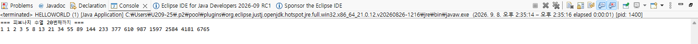
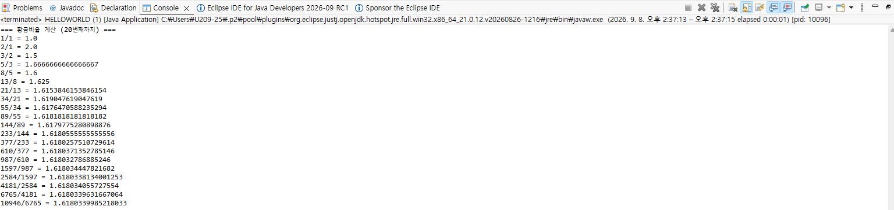
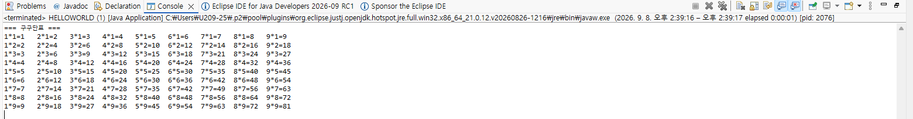
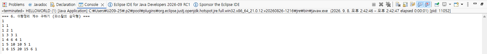

# OOP2026

Homework1

```java
public class HELLOWORLD {
    public static void main(String[] args) {
        
        System.out.println("1");
        for (int i = 0; i < 10; i++) {
            for (int j = 0; j <= i; j++) {
                System.out.print("#");
            }
            System.out.println();
        }
        
        System.out.println();
        
        System.out.println("2");
        for (int i = 0; i < 10; i++) {
            for (int j = 0; j < 9 - i; j++) {
                System.out.print(" ");
            }
            for (int j = 0; j <= i; j++) {
                System.out.print("#");
            }
            System.out.println();
        }
        
        System.out.println();
        
        System.out.println("3");
        for (int i = 0; i < 10; i++) {
            for (int j = 0; j < 10 - i; j++) {
                System.out.print("#");
            }
            System.out.println();
        }
        
        System.out.println();
        
        System.out.println("4");
        for (int i = 0; i < 10; i++) {
            for (int j = 0; j < i; j++) {
                System.out.print(" ");
            }
            for (int j = 0; j < 10 - i; j++) {
                System.out.print("#");
            }
            System.out.println();
        }
    }
}

```


Homework2

```java
public class HELLOWORLD {
    public static void main(String[] args) {
        int n = 20;
        long[] fib = new long[n];
        
        fib[0] = 1;
        fib[1] = 1;

        for (int i = 2; i < n; i++) {
            fib[i] = fib[i - 1] + fib[i - 2];
        }

        System.out.println("=== 피보나치 수열 20번째까지 ===");
        for (int i = 0; i < n; i++) {
            System.out.print(fib[i] + " ");
        }
        System.out.println();
    }
}

```


Homework3

```java
public class HELLOWORLD {
    public static void main(String[] args) {
        int n = 21; 
        long[] fib = new long[n];
        
        fib[0] = 1;
        fib[1] = 1;

        for (int i = 2; i < n; i++) {
            fib[i] = fib[i - 1] + fib[i - 2];
        }

        System.out.println("=== 황금비율 계산 (20번째까지) ===");
        for (int i = 1; i < n; i++) {
            double ratio = (double) fib[i] / fib[i - 1];
            System.out.println(fib[i] + "/" + fib[i - 1] + " = " + ratio);
        }
    }
}

```


Homework4

```java
public class HELLOWORLD {
    public static void main(String[] args) {
        System.out.println("=== 구구단표 ===");
        
        for (int i = 1; i <= 9; i++) {
            for (int j = 1; j <= 9; j++) {
                System.out.print(j + "*" + i + "=" + (j * i) + "\t");
            }
            System.out.println();
        }
    }
}

```


Homework5

```java
public class HELLOWORLD {
    public static void main(String[] args) {
        int iterations = 10000;

        double piLeibniz = 0.0;
        for (int k = 0; k < iterations; k++) {
            double term = 4.0 / (2 * k + 1);
            if (k % 2 == 0) {
                piLeibniz += term;
            } else {
                piLeibniz -= term;
            }
        }

        double sumMadhava = 0.0;
        for (int k = 0; k < iterations; k++) {
            double term = Math.pow(-3, -k) / (2 * k + 1);
            sumMadhava += term;
        }
        double piMadhava = Math.sqrt(12) * sumMadhava;

        System.out.println("=== 원주율(Pi) 계산 결과 (반복 횟수: " + iterations + ") ===");
        System.out.println("Java Math.PI    : " + Math.PI);
        System.out.println("Gregory-Leibniz : " + piLeibniz);
        System.out.println("Madhava         : " + piMadhava);
    }
}

```


homework6

```java

public class HELLOWORLD {
    public static void main(String[] args) {
        int n = 7; 
        int[][] binomial = new int[n][n];

        for (int i = 0; i < n; i++) {
            for (int j = 0; j <= i; j++) {
                if (j == 0 || j == i) {
                    binomial[i][j] = 1;
                } else {
                    binomial[i][j] = binomial[i - 1][j - 1] + binomial[i - 1][j];
                }
            }
        }

        System.out.println("=== 이항정리 계수 구하기 (파스칼의 삼각형) ===");
        for (int i = 0; i < n; i++) {
            for (int j = 0; j <= i; j++) {
                System.out.print(binomial[i][j] + " ");
            }
            System.out.println();
        }
    }
}

```

